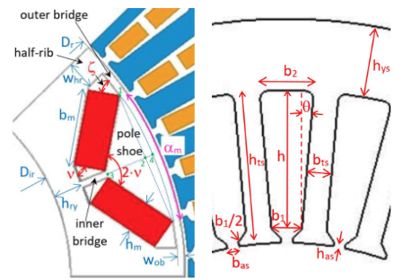

# EJ2223 — IPM Traction Motor Redesign

Coursework project (EJ2223) redesigning a traction motor as an **Interior Permanent Magnet (IPM)** machine, starting from an existing motor.
**Goals:** Optimize the motor to meet the needs of the Formula-E team.

## Table of contents

- [Repository layout](#repository-layout)
- [Design pipeline](#design-pipeline)
- [Quick start](#quick-start)
- [MATLAB API reference](#matlab-api-reference)
- [Rotor bridge stress check — design notes](#rotor-bridge-stress-check--design-notes)
- [Known issues](#known-issues)
- [Open questions / known limitations](#open-questions--known-limitations)

## Repository layout

| Path | Contents |
|---|---|
| `MATLAB_Code/` | Analytical sizing classes, COMSOL scripting, tests, plotting/diagnostic scripts. See [MATLAB API reference](#matlab-api-reference) below. |
| `IPM_Design_Report/` | LaTeX source, figures, bibliography, and compiled PDF for the design report. |
| `COMSOL_models/` | The read-only template `.mph` (tracked) that `ComsolPrebuiltInterface` loads; its solved output `.mph` and a `cache/` of past study results keyed by design point are both gitignored -- a solved model embeds its full time-dependent dataset and can reach several hundred MB, well past what's sane (or, on GitHub, even allowed) to version-control. Both regenerate locally by re-running `main.m` against a running `comsol mphserver`. |
| `references/` | Multiple theory sources like the Uni's course content and reference papers. |
| `doc/` | Diagrams referenced from this README (`ipm_motor_pipeline_architecture.svg`, `ipm_motor_layout.png`). All written documentation now lives in this file. |

## Design pipeline


1. **`MotorSpec`**. validated user inputs:
1.1 Torque. Maximum torque possibly delivered by the machine.
1.2 Corner speed: Maximum speed achieved while maintaining the maximum torque (the speed when the back-EMF is reached).
1.3 DC-link voltage: The voltage delivered by the battery.
1.4 Pole/Slot count: 
1.5 Air-gap:
1.6 Magnet grade:

2. **`EssonsSizer`** and **`IPMRotorSizer`** — turn the spec into a stator/rotor geometry and key electrical parameters (inductances, PM flux linkage), following the analytical method of Di Gerlando & Ricca, *"Design Modeling and Sizing Equations of V-shape IPM Motors,"* ICEM 2022. `IPMRotorSizer` also runs a rotor-bridge centrifugal-stress check once the design converges.
3. **`MotorGeometry`** — collects the sizing results into COMSOL-ready dimensions.
4. **`ComsolInterface`** — builds/updates a 2D FEM sector model in COMSOL (geometry, materials, physics, mesh) and can run a study to extract torque.
5. **Design report** (`IPM_Design_Report/`) — documents the requirements, the analytical design, and validation against the FEM results.

Full class-by-class detail (constructors, inputs, results) is in the [MATLAB API reference](#matlab-api-reference) below.

## Quick start

Run the full analytical sizing pipeline for the project's current design point:

```matlab
run('MATLAB_Code/main.m')
```

Run the test suite (validates the sizing equations against the reference paper's worked example):

```matlab
addpath('MATLAB_Code/tests')
run_all_tests
```

## MATLAB API reference

Class-by-class reference for `MATLAB_Code/`: constructors, inputs, result properties, methods. Read this to know what a class does before reading its source.

<details>
<summary><strong>Expand: full class reference</strong></summary>

### Detailed usage example

```matlab
spec = MotorSpec(200, 2900, 13500, 650, 8, 60, 1, 1.37);

ess = EssonsSizer(spec);
ess.solve();

rotor = IPMRotorSizer(spec);
rotor.solve();

geom = MotorGeometry.fromSizingResults(spec, ess, rotor);
materials = MotorMaterials();

ci = ComsolInterface(geom, materials);
ci.drawStatorSector();
ci.drawRotorSector();
ci.createSelections();
ci.defineMaterials(materials);
ci.saveModel(fullfile(pwd, "motor_model.mph"));
```

### Conventions

- Units:
  - `*_mm` are millimeters, `*_m` are meters.
  - `*_deg` are degrees, `*_rad` are radians.
  - `*_rpm`, `*_Hz`, `*_V`, `*_Nm`, `*_T` follow their SI meaning.
- "Solve" classes (`EssonsSizer`, `IPMRotorSizer`) store results on the object; call `solve()` before accessing results.

---

### `MotorSpec`

Validated input specification for the motor design pipeline.

#### Construction examples

1. Simplest call. Keep arguments in order (positional):
```matlab
spec = MotorSpec(torque_Nm, cornerSpeed_rpm, maxSpeed_rpm, vdcLink_V, Airgap_mm)
```
2. Adding more parameters. Each extra parameter has to be assigned using its keyword:

```matlab
spec = MotorSpec(torque_Nm, cornerSpeed_rpm, maxSpeed_rpm, vdcLink_V, Phases=3, ...);
```

#### Required inputs (positional)

- `torque_Nm` — corner-point torque
- `cornerSpeed_rpm` — corner speed
- `maxSpeed_rpm` — maximum speed (must be `> cornerSpeed_rpm`)
- `vdcLink_V` — DC-link voltage
- `poles` — total number of poles (must be even integer)
- `slots` — total number of slots
- `airgap_mm` — air gap length
- `br20_T` — PM remanence at 20°C

#### Optional properties (Name=Value)
##### Topology/geometry
- `Phases` — Number of electrical phases. Default: 3
- `SlotOpening_mm` — distance between each stator tooth ($b_{as}$). Default: 2 mm.



##### Magnetic
- `MuRec` —
- `kBr_pctPerC` —
- `PMTemp_C` —

##### Targets
- `Bg1_T`, `Bt_T`, `Bc_T` (`Bt_T`/`Bc_T` default to values back-solved from the reference paper's own worked example, not generic engineering defaults)
- Loading: `LinearCurrentDensity_Am`, `CurrentDensity_Amm2`, `CopperFillFactor`
- Process/model: `StackingFactor`, `IronFillFactor`, `AspectRatio`, `EfficiencyEstimate`, `PowerFactor`

#### Computed (dependent) read-only properties

- `SlotsPerPolePerPhase`
- `CornerFrequency_Hz`, `MaxFrequency_Hz`
- `FluxWeakeningRatio`
- `Br_T` — temperature-corrected remanence

#### Methods

- `summary()` — Prints a formatted summary of the spec.
- `toStruct()` — Returns a plain struct containing required, optional, and computed fields.

#### Validation behavior

- Errors if `maxSpeed_rpm <= cornerSpeed_rpm`.
- Errors if winding feasibility rule fails: `Q / (m * t)` must be integer, where `t = gcd(Q, polePairs)`.
- Warns when `gcd(slots, poles) == 1` (high UMP risk due to missing diametric symmetry).

---

### `EssonsSizer`

Esson sizing estimate. Produces a first-pass stator/slot geometry and rotor OD from `MotorSpec`.

#### Construction

```matlab
sizer = EssonsSizer(spec);
% or
sizer = EssonsSizer(spec, WindingFactor=0.91);
```

#### Key properties

- Results (set by `solve()`): `Dis_m`, `Dos_m`, `D_r_m`, `le_m`, `tau_p_m`, `tau_s_m`, `t_s_m`, `h_slot_m`, `h_cs_m`, `Ratio`, `q_spp`, `Solved`
- Convenience: `StatorBore_mm` (dependent) — `Dis_m` in mm

#### Methods

- `solve()` — Runs the sizing calculation and fills result properties.
- `summary()` — Prints formatted results.
- `toStruct()` — Returns a struct with `spec` (from `MotorSpec.toStruct()`) and `results`.

#### Notes

- Includes additional sanity checks (airgap must be much smaller than the computed bore).
- Uses bracketed root finding to compute outer diameter.
- Its stator-bore estimate currently disagrees with `IPMRotorSizer`'s — see [Known issues → Stator bore mismatch](#known-issues).

---

### `IPMRotorSizer`

Analytical rotor sizing for V-shape IPM motors. Runs an iterative loop to converge reaction/saturation parameters and produces rotor geometry + key electrical parameters.

#### Construction

```matlab
sizer = IPMRotorSizer(spec);
% or override rotor design choices
sizer = IPMRotorSizer(spec, AlphaM=0.76, Hm_mm=5.5, Vtilt_deg=75);
% or pin the stator bore directly instead of deriving it from EssonsSizer
% (see Known issues → Stator bore mismatch), and/or supply custom material properties
sizer = IPMRotorSizer(spec, StatorBore_mm=160, Materials=MotorMaterials());
```

#### Configuration properties (design choices)

- Geometry choices: `AlphaM`, `Whr_fraction`, `Wob_mm`, `Hm_mm`, `Vtilt_deg`, `Wib_mm`, `HryFraction`
- Winding: `WindingFactor`, `Has_mm`, `WireClearance_mm`, `RhoEV`
- Iterative parameters (updated by `solve()`): `RhoBtS`, `RhoHteG`, `SigmaAnis`, `Cd`
- Solver settings: `MaxIterations`, `Tolerance`

#### Result properties (set by `solve()`)

- Rotor geometry: `RotorOD_mm`, `RotorID_mm`, `RotorPolePitch_mm`, `Hob_mm`, `Zeta_deg`, `Hib_mm`, `Hhr_mm`, `Dps_mm`, `Bm_mm`, `Whr_mm`, `Hry_mm`, etc.
- Saturation/no-load: `CarterFactor`, `PhiGo_Wbm`, `Bg1o_T`, `PhiG1o_Wbm`
- Torque sizing: `StackLength_mm`, `GammaOpt_deg`, `SpecificTorque_kNmm`, `EtaPhi_c`, `SigmaS_c`
- Winding & stator core sizing: `ConductorsInSeries`, `ConductorsInSlot`, `PhaseCurrent_A`, `NumStrands`, `WireDiameter_mm`, `ToothWidth_mm`, `SlotWidthInner_mm`, `SlotWidthOuter_mm`, `SlotHeight_mm`, `SlotArea_mm2`, `StatorYokeHeight_mm`, `StatorOD_mm` (paper: `D_es`, eq. 94 — not to be confused with `EssonsSizer.Dos_m`/the `D^3L` method's `Dos`, a different, disagreeing estimate; see [Known issues → Stator bore mismatch](#known-issues)) — the actual conductor count/gauge and slot/yoke/OD dimensions a FEM cross-section needs, derived from the corner-point EMF and current density.
- Structural check: `FMaxSpecific_Nm`, `SigmaIbIdeal_MPa`, `SigmaIb_MPa`, `SigmaIbRatio`, `BridgeSafe` — rotor inner-bridge centrifugal stress at max speed vs. the lamination yield strength; `BridgeSafe` is `true` when `SigmaIbRatio < 1`. See [Rotor bridge stress check — design notes](#rotor-bridge-stress-check--design-notes).
- Electrical: `Cq`, `LambdaIs_uHm`, `Ld_mH`, `Lq_mH`, `PsiPM1_Wb`
- Convergence: `Converged`, `Iterations`

#### Methods

- `solve()` — Runs the full loop (internally runs an `EssonsSizer` to get the stator bore).
- `summary()` — Prints formatted results.
- `toStruct()` — Returns a struct containing all results (useful for logging or downstream building).
- `saturationAt(Mq_A)` — Returns saturation factors `(sigma_s, eta_phi)` at the provided q-axis MMF.

#### Notes / limitations

- `solve()` iterates rotor geometry → saturation model → torque sizing → stator winding/core sizing → electrical parameters, until `RhoBtS`, `RhoHteG`, `SigmaAnis`, `Cd` stop changing (or `MaxIterations` is hit); the bridge stress check then runs once on the converged design.
- The reaction coefficients `Cd`, `Cq`, `SigmaAnis` are closed-form integrals of the paper's flux distributions and match its reference values to <2%.
- The no-load saturation/leakage stage (`Bg1o_T`, `PhiGo_Wbm`) is still a calibrated approximation, ~10-20% off the paper's reference values; since `StackLength_mm` and the torque results derive from it, they inherit that gap. See `MATLAB_Code/tests/test_IPMRotorSizer.m`'s diagnostics for current numbers, and [Known issues → No-load leakage underestimated](#known-issues) for a deeper, pole-pitch-scale-dependent version of this gap.
- Iron saturation is handled via a built-in BH curve interpolant; PM flux saturation uses a smooth fit approximation.

---

### `MotorGeometry`

Plain value object holding COMSOL-ready geometry inputs (stator + rotor), derived from sizing results.

#### Construction

- From sizers (recommended):

```matlab
geom = MotorGeometry.fromSizingResults(spec, essonsSizer, rotorSizer);
```

- Manual (Name=Value constructor):

```matlab
geom = MotorGeometry(StatorInnerRadius_m=0.08, Slots=60, PolePairs=4, ...);
```

#### Key properties

- Stator: `StatorInnerRadius_m`, `StatorOuterRadius_m`, `Slots`, `PolePairs`, `SlotDepth_m`, `SlotWidth_m`, `ToothHeight_m`, `StatorYokeHeight_m`
- Rotor: `RotorOuterRadius_m`, `RotorInnerRadius_m`, `Airgap_m`, `MagnetLength_m`, `MagnetWidth_m`, `MagnetSpacing_m`, `MagnetRibHeight_m`, `MagnetAngle_rad`

#### Methods

- `fromSizingResults(spec, essonsSizer, rotorSizer)` (static) — Validates that both sizers are solved/converged and converts units.
- `toStruct()` — Returns a struct suitable for logging/serialization.

---

### `MotorMaterials`

Typed container for COMSOL material constants.

#### Usage

```matlab
mats = MotorMaterials();
mats.mu_r_iron = 4000;   % optional override
```

#### Properties

- Meshing: `mesh_size`
- Shaft: `mu_r_shaft`, `sigma_shaft`, `epsilon_r_shaft`
- Iron: `mu_r_iron`, `sigma_iron`, `epsilon_r_iron`
- Air: `mu_r_air`, `sigma_air`
- Magnets: `mu_r_magnets`, `sigma_magnets`, `Br`
- Copper: `mu_r_copper`, `sigma_copper`, `epsilon_r_copper`
- Mechanical (used by `IPMRotorSizer`'s rotor-bridge check, not by COMSOL): `rho_lam`, `sigma_y_lam` (lamination density/yield strength), `rho_pm` (magnet density), `Kt_ib` (bridge stress concentration factor). Defaults are datasheet values for the paper's named grades (M235-35A lamination, N48UZ-SGR magnet) — see [Rotor bridge stress check — design notes](#rotor-bridge-stress-check--design-notes).

---

### `ComsolPrebuiltInterface`

MATLAB wrapper around COMSOL LiveLink that pushes sizing results into the prebuilt AC/DC Application Library IPM model (Part Instances `pi1`/`pi2`, see `references/models.acdc.interior_pm_motor_stress_analysis.pdf`), rather than drawing geometry from scratch.

#### Construction

```matlab
ci = ComsolPrebuiltInterface();
% or override the template/output paths
ci = ComsolPrebuiltInterface(TemplatePath=..., OutputPath=...);
```

- `TemplatePath` (default `COMSOL_models/interior_pm_motor_stress_analysis_original.mph`) — read-only; never written to.
- `OutputPath` (default `COMSOL_models/interior_pm_motor_stress_analysis.mph`) — where `saveModelAs()` writes.

#### Methods

- `pushGeometry(Np=, Ns=, Airgap_mm=, StatorYokeHeight_mm=, RotorDiameter_mm=, ShaftDiameter_mm=, L_mm=, MaxSpeed_rpm=)` — Sets Global Parameters and re-pins the Part Instance inputs known to need a symbolic reference (e.g. `backiron_th → h_sy`, `shaft_diam → d_s`). `MaxSpeed_rpm` drives `w_rot`, the rotation speed the coupled structural sweep evaluates the rotor-bridge stress at -- re-pinned on every push for the same "can't silently drift" reason as `backiron_th`.
- `pushExcitation(Ipk_A=)` — Sets the stator coil peak current. `init_ang` is left alone -- see the method's docstring for why.
- `rebuildGeometry()` — Re-runs the geometry sequence; surfaces COMSOL's own Parameter Check errors if a pushed value is infeasible.
- `configureSolveSettings(MeshLevel=, NumElectricalCycles=, TimeStepsPerCycle=)` — Optional, for draft/iteration runs only (leave untouched for the numbers that go in the report). `MeshLevel` is COMSOL's own 1(finest)-9(coarsest) predefined mesh scale -- the same convention as `MotorMaterials.mesh_size` (e.g. `configureSolveSettings(MeshLevel=materials.mesh_size)`, not called automatically). `NumElectricalCycles`/`TimeStepsPerCycle` shrink the Time Dependent sweep (template default: 3 cycles × 24 steps/cycle = the `N_tsteps=72` in `references/interior_pm_motor_stress_analysis_parameters.txt`). Trades solve time for precision/settled-ripple statistics -- see the method's docstring.
- `summary()` — Prints the pushed values back as evaluated by the model.
- `runStudy()` — Runs `std1` (Stationary + Time Dependent coupled EM/structural sweep, ~20 min).
- `runStudyCached(Force=, CacheDir=, FigureDir=)` — Reuses a previous `runStudy()`+`resultsSummary()` result from `COMSOL_models/cache/` when the pushed design point (Np, Ns, airgap, h_sy, d_r, L, w_rot, Ipk, N_tsteps) is unchanged from a cached run; otherwise solves, prints, and caches. `Force=true` ignores any cache hit. `FigureDir`, if given, re-renders plots (`plotAll`) on a fresh solve. This is main.m's normal entry point for the study -- prefer it over calling `runStudy()`/`resultsSummary()` directly.
- `resultsSummary()` — Torque (avg + ripple), peak von Mises stress, peak displacement.
- `plot(plotGroupTag, ...)`, `plotTorque()`, `plotStress()`, `plotFluxDensity()`, `plotDisplacement()`, `plotAll(outputDir)` — Render the model's own pre-built Result plot groups (`pg1`..`pg8`) via `mphplot`.
- `saveModelAs(savePath?)` — Saves to `OutputPath` by default; refuses to write to `TemplatePath`.

#### Operational notes

- Requires a running COMSOL server (`comsol mphserver`) and MATLAB LiveLink functions (`mphstart`, `mphload`, ...).
- Connecting/loading is lazy -- nothing happens until the first method that needs the model.

</details>

---

### `EfficiencyMapSizer`

Rough analytical loss and efficiency-map estimate over the torque-speed operating envelope, built entirely from a converged `IPMRotorSizer` -- no extra FEM runs. This is what produces the "energy efficiency map over the whole torque-speed range" the assignment brief asks for in Part B; the FEM stage (`ComsolPrebuiltInterface`) separately validates torque at the single rated design point.

#### Construction

```matlab
em = EfficiencyMapSizer(spec, rotorSizer, materials);  % rotorSizer must already be solve()d
```

#### Methods

- `solve(SpeedPoints=, TorquePoints=)` — Computes phase resistance, a core-loss model, and sweeps the torque-speed grid (closed-form; well under a second even at fine resolution).
- `summary()` — Phase resistance, stator core mass, and the rated (corner) point's copper loss / core loss / efficiency.
- `plotMap(SavePath=)` — Efficiency contour with the achievable envelope, rated point, and the assignment's peak-torque/max-speed targets (Table 1) marked for context.

#### Key properties (set by `solve()`)

- `PhaseResistance_Ohm`, `MassTeeth_kg`, `MassYoke_kg`
- `RatedCopperLoss_W`, `RatedCoreLoss_W`, `RatedEfficiency_pct`
- `Speed_rpm`, `Torque_Nm`, `Efficiency_pct` (grid, `NaN` outside the achievable envelope), `EnvelopeTorque_Nm`

#### Modeling assumptions (all documented in the class header and flagged in `summary()`/the design report)

- Copper loss: phase resistance from a geometric mean-turn-length estimate (non-overlapping, single-tooth-wound coils), evaluated at an assumed hot winding temperature (`CuOperatingTemp_C`, default 100°C).
- Core loss: a two-term Steinmetz fit calibrated to M235-35A's single datasheet point (P<sub>1.5/50</sub>=2.35 W/kg, literally what "235" means in the EN 10106 grade name), extrapolated up to this design's much higher electrical frequency -- the map's single biggest source of uncertainty (see `summary()`'s printed extrapolation factor).
- Mechanical (windage/bearing) losses: excluded -- no validated model at this design stage.
- At/below corner speed: `Id=0`, matching `IPMRotorSizer`'s own corner-point assumption (the same current pushed into the FEM as `Ipk`) -- not re-derived from a voltage-limit check, which would just collide with the already-documented PM flux-linkage shortfall (see [Known issues → No-load leakage underestimated](#known-issues)) at exactly that point. Above corner speed: `Id` is solved from a simplified (resistive-drop-neglected) voltage-limit equation at fixed `Iq`.

## Rotor bridge stress check — design notes

Working notes for the "Rotor Bridge Sizing and Structural Integrity" check in `IPMRotorSizer.m` / the design report: paper sourcing, material-property provenance, and an implementation log.

<details>
<summary><strong>Expand: sourcing, material properties, implementation log</strong></summary>

### Primary reference

A. Di Gerlando, C. Ricca, "Design Modeling and Sizing Equations of V-shape IPM Motors," ICEM 2022, DOI: 10.1109/ICEM51905.2022.9910924 — `references/Design_Modeling_and_Sizing_Equations_of_V-shape_IPM_Motors.pdf` (the same paper `IPMRotorSizer.m` already implements for eqs. 1-18, 38-42, 57-64, 95-120 — the class header cites it).

Section IV, "Rotor Bridges Sizing and Check", gives (variables/text as extracted from the PDF; `_` = subscript):

```
specific max centrifugal force:  f_max = m_1p * R_av * Omega_max^2      (19)
ideal stress of inner bridge:    sigma_ib.i = f_max / (w_ib * k_st)     (20)
actual stress (Kt concentration factor): sigma_ib = Kt * sigma_ib.i     (21)
check: sigma_ib / sigma_y.lam                                          (22)
```

Worked example in the paper (their Fig. 4 design point, which is also the default geometry `IPMRotorSizer.m` reproduces): `Kt = 1.66`, `sigma_ib/sigma_y.lam = 0.783`, `k_st = 0.97` (matches `MotorSpec`'s `StackingFactor` default already).

Practical bridge-width rule given in the same section: `w_ib = 5 * w_ob`, with `w_ob` floored at the minimum manufacturable lamination width `w_ob > w_lam = 0.35 mm`.

**Gap**: the paper does not spell out `m_1p` (rotating mass "of pole shoe and PM segments", per unit axial length — "specific") or `R_av` (its centroid radius) as explicit formulas in the extractable text. First-order approximation used, matching what's sketched in `IPM_Design_Report.tex` (§Rotor Bridge Sizing and Structural Integrity, eqs. 1-4 — magnet-only, pole-shoe iron neglected):

```
m_1p ≈ 2 * rho_pm * b_m * h_m          (two magnets per pole, per unit length)
R_av ≈ Dr/2 - Dps/2                    (centroid ~ mid pole-shoe depth)
```

This neglects the pole-shoe iron mass outboard of the bridge, so it under-estimates `f_max` (non-conservative). Flagged as a known simplification; revisit if the margin against `sigma_y_lam` ends up tight.

### Material property sourcing (not in paper — pulled from datasheets)

Paper's named grades: stator/rotor lamination = **M235-35A**, PM = **N48UZ-SGR**.

| Property | Value | Source |
|---|---|---|
| `sigma_y_lam` (M235-35A yield, 0.2% proof, rolling dir.) | 460 MPa | Tata Steel M235-35A datasheet, https://www.tatasteeluk.com/sites/default/files/m235-35a.pdf |
| `rho_lam` (M235-35A density) | ≈7650 kg/m³ | Matmatch / EN 10106 M235-35A, https://matmatch.com/materials/arce0145-en-10106-grade-m235-35a |
| `rho_pm` (sintered NdFeB, all N-grades incl. N48UZ-SGR) | ≈7500 kg/m³ | standard industry value, e.g. ACH Magnets N48 datasheet, https://datasheets.globalspec.com/ds/ach-magnets/n48/5779689f-9ede-4f4b-b358-155fbaa0cfb0 |
| `Kt` (inner bridge stress concentration) | 1.66 | Di Gerlando & Ricca, eq. (21) — fit to *their* fillet geometry, not a general formula |

Decision (confirmed with user 2026-07-21): use `Kt = 1.66` as a constant for now rather than a geometry-dependent fit. Revisit if bridge proportions end up far from the paper's example.

### Secondary references (not yet pulled in, for a more rigorous Kt later)

- "Analytical method to compute bridge stresses in V-shape IPMs," IET Electric Power Applications, 2018 — https://digital-library.theiet.org/doi/10.1049/iet-epa.2018.0053 — earlier, deeper treatment of the same inner/outer bridge stress problem, likely what the ICEM 2022 §IV condenses.
- "Investigation of the Stress Concentration Factor for Estimating Maximum Mechanical Stress of Interior Permanent-Magnet Machines," IEEE — https://ieeexplore.ieee.org/document/8507225/ — fits an explicit `Kt(geometry)` polynomial from FEA sweeps; would let `Kt` adapt to our actual bridge width/fillet radius instead of using the fixed 1.66.

### Implementation status (done 2026-07-21)

1. DONE — `MotorMaterials.m`: added `rho_lam`, `sigma_y_lam`, `rho_pm`, `Kt_ib` properties with the datasheet defaults above.
2. DONE — `IPMRotorSizer.m`: constructor now accepts optional `Materials` (`MotorMaterials`, defaults to `MotorMaterials()`); `computeBridgeStress_()` private stage (eqs. 19-22) runs once after `solve()`'s convergence loop; new result properties `FMaxSpecific_Nm`, `SigmaIbIdeal_MPa`, `SigmaIb_MPa`, `SigmaIbRatio`, `BridgeSafe`; wired into `summary()`/`toStruct()`.
3. DONE — `tests/test_IPMRotorSizer.m` extended with a sanity check on the bridge stress ratio (paper spec, default geometry): our result is `sigma_ib/sigma_y_lam ≈ 0.596` vs. the paper's `0.783` — same order of magnitude, and *lower* in exactly the direction expected from neglecting pole-shoe iron mass (non-conservative simplification, confirmed consistent). Can't assert exact match since `m_1p`/`R_av` are our own approximation of an unstated paper formula.
4. DONE — `MATLAB_Code/rotor_bridge_stress_sweep.m`: sweeps `Wib_mm`, plots `SigmaIb_MPa` vs. bridge width at `n_max`, marks the yield line, the `w_ib = 5*w_ob` manufacturing-floor line, and the current design point. **Currently runs against the paper's reference spec** (`MotorSpec(200,2900,13500,650,8,60,1,1.37)`, default rotor geometry), not the project's actual `main.m` parameters. Output plot copied to `IPM_Design_Report/figures/rotor_bridge_stress_sweep.png`.
5. NOT DONE — Report: §Rotor Bridge Sizing and Structural Integrity still has the old unnumbered-paraphrase equations; should be updated with the actual computed numbers and point directly at the ICEM 2022 paper's eqs. (19)-(22).

</details>

## Known issues

<details>
<summary><strong>Rotor geometry infeasibility for aggressive <code>AlphaM</code>/<code>Whr_fraction</code> — resolved</strong></summary>

`computeRotorGeometry_`'s eq. (9) (outer bridge tangential length) can go negative for some `AlphaM`/`Whr_fraction`/pole combinations:

```matlab
% Eq. (9)  outer bridge tangential length
h_ob = (tau_r - 2*w_hr - b_ps) / 2;
if h_ob <= 0
    error('IPMRotorSizer:geometry', ...
        'h_ob <= 0 (%.3f mm). Reduce AlphaM or Whr_fraction.', h_ob);
end
```

This previously blocked `main.m`'s own design point (`poles=10, AlphaM=0.83, Whr_fraction=0.1` gave `h_ob = -5.251 mm`) — not a bug in the equation itself, but the error message should be (and mostly is) explicit about *why* the geometry is infeasible. `main.m` now uses `AlphaM=0.80`, which resolves it for the current design point; the underlying validation could still be tightened to check `AlphaM`/`Whr_fraction` combinations up front instead of failing deep inside `solve()`.

</details>

<details>
<summary><strong>Stator bore mismatch (<code>EssonsSizer</code> vs. <code>IPMRotorSizer</code>) — open</strong></summary>

`EssonsSizer` and `IPMRotorSizer` yield different values for the stator bore. `EssonsSizer` implements a generic Esson's-rule / Lipo-book first-pass sizing (from torque/loading assumptions in `MotorSpec`), which does not reproduce the reference paper's own worked example (D=160mm, Di Gerlando & Ricca ICEM 2022, Fig. 4) — even fed the paper's own `AspectRatio`, `EssonsSizer` computes `Dis ≈ 169.2mm`, not 160mm (~5.8% off). See `test_EssonsSizer.m`'s own FIXME comment.

Status: partially mitigated, not fixed. `IPMRotorSizer` accepts an optional `StatorBore_mm` constructor override (added 2026-07-22) that bypasses the internal `EssonsSizer` call entirely, so callers who already know the bore (e.g. a paper reference point, or a future converged multi-stage design) can pin it directly instead of going through `EssonsSizer`'s estimate. `test_IPMRotorSizer.m` uses this to validate `IPMRotorSizer`'s own rotor-geometry equations (paper eqs. 8-18) in isolation, independent of this bug.

Not fixed: `main.m`'s default flow (no override) still calls `EssonsSizer` internally, so it still gets `EssonsSizer`'s own bore estimate, which may differ meaningfully from what a "correct" design would use. `test_EssonsSizer.m` still fails for this reason and remains open — reconciling `EssonsSizer`'s methodology with the paper (or deciding they're intentionally different design stages) needs a separate investigation.

Solution: TBD.

</details>

<details>
<summary><strong>No-load leakage underestimated at small pole pitch — open</strong></summary>

> **Note (cleanup pass):** the FEMM/xfemm cross-check pipeline this issue cites as evidence (`femm_run_noload.m`, `femm_geometry.m`, `femm_write_lua.m`, `femm_run_noload_paper.m`, `femm_out/`) has since been removed from the repo (superseded by the `ComsolPrebuiltInterface` branch). The findings/numbers below are still valid historical evidence of the gap; they just can't be reproduced by running those scripts anymore.

`IPMRotorSizer.computeSaturationModel_`'s no-load PM leakage term is a hardcoded constant, not a geometry-derived quantity:

```matlab
% Bridge leakage permeance (both bridges combined, per unit length)
% — uses a simplified ratio matching paper Fig. 8 at Mq=0
leakage_no_load = 0.166;
phi_go   = phi_PM * (1 - leakage_no_load) * alpha_m;
```

This value is lifted directly from the reference paper's own reported result for *its own* worked example (200Nm/8-pole/60-slot, rotor pole pitch `tau_r` = 62.05mm) and is never recomputed from `Wob_mm`/`Wib_mm`/`tau_r` for a different design point — it is applied unchanged regardless of how different the actual bridge-width-to-pole-pitch ratio is.

This project's own design point (9.8Nm/10-pole/12-slot, `tau_r` = 22.21mm — 2.8x smaller than the paper's, since `Wob_mm`/`Wib_mm` default to the *same* absolute values, 0.5mm/2.5mm, regardless of pole pitch) exposes this. A from-scratch FEMM/xfemm no-load FEA cross-check gave `Bg1_femm = 0.30T` against `IPMRotorSizer.Bg1o_T = 0.83T` — a **-63% gap** — versus only -1% to +6% for the identical FEMM pipeline run on the paper's own design point.

Backing the implied leakage fraction out of FEMM's own result via the model's own eq. 39–42 relationship (isolating just the leakage term, holding `alpha_m`/`Bm_mm`/`tau_r`/`Br` fixed) gives:

| Design (pole pitch) | Bridges `Wob`/`Wib` [mm] | FEMM-implied leakage | Model assumes |
|---|---|---|---|
| Paper (`tau_r`=62.05mm) | 0.5 / 2.5 (validated) | 11.8% | 16.6% |
| This project (`tau_r`=22.21mm), current defaults | 0.5 / 2.5 | 69.4% | 16.6% |
| This project, realistic manufacturable minimum (paper's own stated floor, `Wob`>`w_lam`=0.35mm, `Wib`=5·`Wob`) | 0.35 / 1.75 | 64.9% | 16.6% |
| This project, hypothetical bridges matched to the paper's `Wob`/`tau_r` fraction (below the manufacturable floor — sensitivity probe only, not a real design) | 0.18 / 0.89 | 49.1% | 16.6% |

The model is well-calibrated at the paper's own scale (11.8% vs. an assumed 16.6%) but real leakage at this project's pole pitch is 4–6x what the constant assumes, and even the best *physically manufacturable* bridge geometry only recovers part of it (69.4% → 64.9%) — some of the excess leakage likely comes from bridge *count* (10 poles × 2 legs × 2 bridges = 40 bridges packed into a much smaller rotor circumference than the paper's 8-pole layout), not just individual bridge width. Not investigated further.

Also found and fixed in the same investigation: `Hob_mm`/`Wob_mm` were swapped in the FEMM geometry export (`h_ob` is the paper's *tangential* bridge length, eq. 9; `w_ob` is the *radial* bridge depth — confirmed against the paper's own Fig. 1). This was a real bug, but only a secondary effect on this issue — fixing it improved the paper design's FEMM-vs-paper agreement (-13.4% → -7.3%) but barely moved the small motor's shortfall (0.323T → 0.305T), so it does not explain the gap documented here.

Status: not fixed. `IPMRotorSizer.Bg1o_T` — and everything downstream of it through `computeTorqueSizing_`/`computeElectricalParameters_` (`GammaOpt_deg`, `StackLength_mm`, `SpecificTorque_kNmm`, `PhaseCurrent_A`, etc.) — is overoptimistic for this project's actual design point by a wide margin at no load, and that cascades through the whole rated-operating-point sizing chain.

Solution: TBD. Two options: (a) replace `leakage_no_load` with the paper's own eqs. 24–30 magnetic network (uses `Wob_mm`/`Wib_mm`/`tau_r` directly and self-consistently, including bridge saturation) instead of a copied scalar; or (b) treat ~0.3–0.4T as this design's real achievable no-load `Bg1` and re-run the torque/current sizing chain against that number instead of `Bg1o_T`, at least until (a) is done.

</details>

## Open questions / known limitations

- Whether the reference motor (`DD5-14-10-POW-18600-B5`) is itself IPM or SPM is unresolved: rotor images suggest IPM, but the professor asserts it is SPM with slight anisotropy accounting for $L_d \neq L_q$.
- `EssonsSizer`'s stator bore estimate doesn't match the reference paper's own worked example (~6% off) — see [Known issues → Stator bore mismatch](#known-issues).
- The no-load saturation/leakage model (`IPMRotorSizer.computeSaturationModel_`) is a calibrated approximation, currently ~10–20% off the paper's reference values at the paper's own scale, and 4–6x off at this project's much smaller pole pitch — see [Known issues → No-load leakage underestimated](#known-issues) and the diagnostics in `MATLAB_Code/tests/test_IPMRotorSizer.m`.