# MATLAB API Reference (EJ2223 Assignment)

This document describes the MATLAB class APIs under `MATLAB_Code/`.

## Architecture Overview



The diagram shows the typical workflow:
1. **MotorSpec** holds user inputs (torque, speed, voltages, topology).
2. **EssonsSizer** and **IPMRotorSizer** run in parallel to compute stator and rotor geometries from the spec.
3. **MotorGeometry** collects all geometric dimensions (value object, copyable).
4. **COMSOLBuilder** (or `ComsolInterface`) uses the geometry to draw 2D sector model, define materials, and set up physics.
5. **ResultsAnalyser** extracts torque, flux, losses from FEM results for performance validation.

---

## Quick start (typical pipeline)

```matlab
spec = MotorSpec(200, 2900, 13500, 650, 8, 60, 1, 1.37);

ess = EssonsSizer(spec);
ess.solve();

rotor = IPMRotorSizer(spec);
rotor.solve();

geom = MotorGeometry.fromSizingResults(spec, ess, rotor);
materials = MotorMaterials();

ci = ComsolInterface(geom, materials);
ci.drawStatorSector();
ci.drawRotorSector();
ci.createSelections();
ci.defineMaterials(materials);
ci.saveModel(fullfile(pwd, "motor_model.mph"));
```

## Conventions

- Units:
  - `*_mm` are millimeters, `*_m` are meters.
  - `*_deg` are degrees, `*_rad` are radians.
  - `*_rpm`, `*_Hz`, `*_V`, `*_Nm`, `*_T` follow their SI meaning.
- “Solve” classes (`EssonsSizer`, `IPMRotorSizer`) store results on the object; call `solve()` before accessing results.

---

# Class reference

## `MotorSpec`

Validated input specification for the motor design pipeline.

### Construction

```matlab
spec = MotorSpec(torque_Nm, cornerSpeed_rpm, maxSpeed_rpm, vdcLink_V, ...
                 poles, slots, airgap_mm, br20_T, Name=Value...);
```

### Required inputs (positional)

- `torque_Nm` — corner-point torque
- `cornerSpeed_rpm` — corner speed
- `maxSpeed_rpm` — maximum speed (must be `> cornerSpeed_rpm`)
- `vdcLink_V` — DC-link voltage
- `poles` — total number of poles (must be even integer)
- `slots` — total number of slots
- `airgap_mm` — air gap length
- `br20_T` — PM remanence at 20°C

### Optional properties (Name=Value)

- Topology/geometry: `Phases`, `SlotOpening_mm`, `Airgap_mm`
- Magnet: `MuRec`, `kBr_pctPerC`, `PMTemp_C`
- Targets: `Bg1_T`, `Bt_T`, `Bc_T`
- Loading: `LinearCurrentDensity_Am`, `CurrentDensity_Amm2`, `CopperFillFactor`
- Process/model: `StackingFactor`, `IronFillFactor`, `AspectRatio`, `EfficiencyEstimate`, `PowerFactor`

### Computed (dependent) read-only properties

- `SlotsPerPolePerPhase`
- `CornerFrequency_Hz`, `MaxFrequency_Hz`
- `FluxWeakeningRatio`
- `Br_T` — temperature-corrected remanence

### Methods

- `summary()`
  - Prints a formatted summary of the spec.
- `toStruct()`
  - Returns a plain struct containing required, optional, and computed fields.

### Validation behavior

- Errors if `maxSpeed_rpm <= cornerSpeed_rpm`.
- Errors if winding feasibility rule fails: `Q / (m * t)` must be integer, where `t = gcd(Q, polePairs)`.
- Warns when `gcd(slots, poles) == 1` (high UMP risk due to missing diametric symmetry).

---

## `EssonsSizer`

Esson sizing estimate. Produces a first-pass stator/slot geometry and rotor OD from `MotorSpec`.

### Construction

```matlab
sizer = EssonsSizer(spec);
% or
sizer = EssonsSizer(spec, StatorODWarnLimit_m=120e-3);
```

### Key properties

- Configuration:
  - `StatorODWarnLimit_m` — warning threshold for the computed stator OD
- Results (set by `solve()`):
  - `Dis_m`, `Dso_m`, `Dro_m`, `le_m`, `tau_p_m`, `tau_s_m`, `t_s_m`, `h_slot_m`, `h_cs_m`, `Ratio`, `q_spp`
  - `Solved`
- Convenience:
  - `StatorBore_mm` (dependent) — `Dis_m` in mm

### Methods

- `solve()`
  - Runs the sizing calculation and fills result properties.
- `summary()`
  - Prints formatted results.
- `toStruct()`
  - Returns a struct with `spec` (from `MotorSpec.toStruct()`) and `results`.

### Notes

- Includes additional sanity checks (airgap must be much smaller than the computed bore).
- Uses bracketed root finding to compute outer diameter.

---

## `IPMRotorSizer`

Analytical rotor sizing for V-shape IPM motors. Runs an iterative loop to converge reaction/saturation parameters and produces rotor geometry + key electrical parameters.

### Construction

```matlab
sizer = IPMRotorSizer(spec);
% or override rotor design choices
sizer = IPMRotorSizer(spec, AlphaM=0.76, Hm_mm=5.5, Vtilt_deg=75);
```

### Configuration properties (design choices)

- Geometry choices: `AlphaM`, `Whr_fraction`, `Wob_mm`, `Hm_mm`, `Vtilt_deg`, `Wib_mm`, `HryFraction`
- Winding: `WindingFactor`
- Iterative parameters (updated by `solve()`): `RhoBtS`, `RhoHteG`, `SigmaAnis`, `Cd`
- Solver settings: `MaxIterations`, `Tolerance`

### Result properties (set by `solve()`)

- Rotor geometry: `RotorOD_mm`, `RotorID_mm`, `RotorPolePitch_mm`, `Hob_mm`, `Zeta_deg`, `Hib_mm`, `Hhr_mm`, `Dps_mm`, `Bm_mm`, `Whr_mm`, `Hry_mm`, etc.
- Saturation/no-load: `CarterFactor`, `PhiGo_Wbm`, `Bg1o_T`, `PhiG1o_Wbm`
- Torque sizing: `StackLength_mm`, `GammaOpt_deg`, `SpecificTorque_kNmm`, `EtaPhi_c`, `SigmaS_c`
- Electrical: `Cq`, `LambdaIs_uHm`, `Ld_mH`, `Lq_mH`, `PsiPM1_Wb`
- Convergence: `Converged`, `Iterations`

### Methods

- `solve()`
  - Runs the full loop (internally runs an `EssonsSizer` to get the stator bore).
- `summary()`
  - Prints formatted results.
- `toStruct()`
  - Returns a struct containing all results (useful for logging or downstream building).
- `torqueFunction(Delta_Am, gamma_deg)`
  - Evaluates the per-unit torque function used in the paper (after `solve()`).
- `saturationAt(Mq_A)`
  - Returns saturation factors `(sigma_s, eta_phi)` at the provided q-axis MMF.

### Notes / limitations

- `RhoHteG` is not fully updated by the internal stator/winding model; it is seeded and left largely constant.
- Iron saturation is handled via a built-in BH curve interpolant; PM flux saturation uses a smooth fit approximation.

---

## `MotorGeometry`

Plain value object holding COMSOL-ready geometry inputs (stator + rotor), derived from sizing results.

### Construction

- From sizers (recommended):

```matlab
geom = MotorGeometry.fromSizingResults(spec, essonsSizer, rotorSizer);
```

- Manual (Name=Value constructor):

```matlab
geom = MotorGeometry(StatorInnerRadius_m=0.08, Slots=60, PolePairs=4, ...);
```

### Key properties

- Stator: `StatorInnerRadius_m`, `StatorOuterRadius_m`, `Slots`, `PolePairs`, `SlotDepth_m`, `SlotWidth_m`, `DrawOnlySector`
- Rotor: `RotorOuterRadius_m`, `RotorInnerRadius_m`, `Airgap_m`, `MagnetLength_m`, `MagnetWidth_m`, `MagnetSpacing_m`, `MagnetRibHeight_m`, `MagnetAngle_rad`

### Methods

- `fromSizingResults(spec, essonsSizer, rotorSizer)` (static)
  - Validates that both sizers are solved/converged and converts units.
- `toStruct()`
  - Returns a struct suitable for logging/serialization.

---

## `MotorMaterials`

Typed container for COMSOL material constants.

### Usage

```matlab
mats = MotorMaterials();
mats.mu_r_iron = 4000;   % optional override
```

### Properties

- Meshing: `mesh_size`
- Shaft: `mu_r_shaft`, `sigma_shaft`, `epsilon_r_shaft`
- Iron: `mu_r_iron`, `sigma_iron`, `epsilon_r_iron`
- Air: `mu_r_air`, `sigma_air`
- Magnets: `mu_r_magnets`, `sigma_magnets`, `Br`

---

## `ComsolInterface`

MATLAB wrapper around COMSOL LiveLink that supports:

1) Building a new 2D sector model from `MotorGeometry` + `MotorMaterials` and saving it to an `.mph`, and
2) Running a pre-existing template `.mph` study (load → set parameters → run → extract torque), and
3) Updating parameters inside an existing `.mph` file and saving the updated model (without building geometry).

### Construction

Supported call patterns:

```matlab
ci = ComsolInterface();
ci = ComsolInterface(configStruct);
ci = ComsolInterface(motorGeometry);
ci = ComsolInterface(motorGeometry, motorMaterials);
ci = ComsolInterface(configStruct, motorGeometry);
ci = ComsolInterface(configStruct, motorGeometry, motorMaterials);
```

### Config struct fields (commonly used)

- `projectRoot` — root folder used to resolve scripts and default paths
- `modelPath` — `.mph` to load when using `run()` (defaults to `COMSOL_models/pm_motor_2d_introduction.mph`)
- `studyTag` — COMSOL Study tag (default `"std1"`)
- `resultTableTag` — Results table tag to read torque from (default `"tbl1"`)
- `saveResults`, `savePath` — whether/where to write `Simulation_Results.mat`
- `makePlot` — whether to plot torque vs time
- `comsolMliDir` — override path to COMSOL MLI folder (or use env `COMSOL_MLI_DIR`)
- Advanced: `compTag` (default `"comp1"`), `geomTag` (default `"geom1"`), `physTag` (default `"mf"`)

### Build-and-save model methods (creates a new model in memory)

- `setMotorGeometry(geometry)`
- `setMaterialData(materialData)`
- `drawStatorSector(geometry?)`
  - Adds stator ring + slots + copper regions.
- `drawRotorSector(geometry?)`
  - Adds rotor + airgap + magnet pockets and caches magnet points.
- `createSelections(geometry?)`
  - Creates domain/boundary selections for iron, shaft, airgap, magnets, and sector sides.
  - Requires `drawRotorSector()` first.
- `defineMaterials(materialData?, geometry?)`
  - Assigns materials and defines magnet/periodic physics features; creates mesh.
- `saveModel(savePath)`
  - Saves the in-memory built model to an `.mph`.

### Template update methods (loads an existing model, writes params, saves)

- `writeParametersToExistingModel(modelPath, params, savePath=...)`
  - Loads an existing `.mph`, pushes parameters via `mphsetparam`, then saves (defaults to overwriting `modelPath`).
- `writeInteriorPmMotorStressAnalysisModel(spec, essonsSizer, rotorSizer, ...)`
  - Convenience method that writes the parameter set expected by the interior-PM stress-analysis template.
  - Defaults: loads `COMSOL_models/original_interior_pm_motor_stress_analysis.mph` and saves to `COMSOL_models/modified_interior_pm_motor_stress_analysis.mph`.
  - Important option: `shaftDiam_mm` (recommended) sets the mechanical shaft diameter (`d_s`) explicitly.
  - Parameter names/expressions follow `doc/interior_pm_motor_stress_analysis_parameters.txt`.

### Static parameter helpers

- `ComsolInterface.makeInteriorPmMotorStressAnalysisParams(spec, essonsSizer, rotorSizer, ...)`
  - Returns `(params, info)` where `params` is the COMSOL parameter struct and `info` lists derived parameters and assumptions.

### Simulation runner methods (loads and runs an existing model)

- `run(params)`
  - Loads `config.modelPath`, pushes parameters via `mphsetparam`, runs `studyTag`, reads torque from `resultTableTag`, optionally saves `Simulation_Results.mat`.

`params` may be a struct, `containers.Map`, or an `Nx2` cell array of `{name, expression}`.

### Static convenience methods

- `ComsolInterface.runComsolSimulation(params, config)`
  - One-liner: construct interface and run.
- `ComsolInterface.start(config)`
  - Adds MLI path (if found) and connects to COMSOL server.

### Operational notes

- Requires a running COMSOL server (`comsol mphserver`) and MATLAB LiveLink functions (`mphstart`, `mphload`, `mphsetparam`, `mphtable`, ...).
- The build-and-save path does not create studies/solvers by default; you typically open the saved `.mph` in COMSOL and add a Study.
